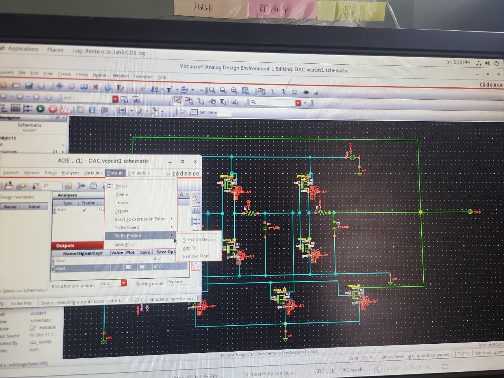

# 🌿 Early Stage Identification of Red Spider Mite (Oligonychus coffeae) Attack in Tea Gardens using ASIC-Based Detector and Electronic Repellent

## 📌 Project Summary

This project focuses on the development of a low-power ASIC-oriented electronic system for the early-stage identification of Red Spider Mite (Oligonychus coffeae) infestation in tea gardens of North Eastern India and the development of an ultrasonic electronic repellent system for possible pest dispersal.

The work combines analog CMOS circuit design, signal processing, ultrasonic frequency generation, and ASIC implementation concepts for agricultural monitoring applications.

The proposed system aims to:
- Detect infestation at an early stage
- Reduce dependency on chemical pesticides
- Enable low-power field deployment
- Generate ultrasonic signals for pest dispersal

---

## 🏛️ Funding Agency

Ministry of Electronics and Information Technology (MeitY), Government of India

---

## 👨‍🏫 Supervisor

Dr. Pankaj Sarkar  
Department of Electronics and Communication Engineering  
North-Eastern Hill University (NEHU), Shillong  
Email: psarkar@nehu.ac.in

---

# 🧠 System Overview

The complete system consists of two major functional blocks:

1. Early-stage infestation detection system
2. Ultrasonic electronic repellent system

The detector section uses sensor-based signal acquisition and analog signal conditioning techniques to identify leaf-condition changes caused by Red Spider Mite attack.

The repellent section uses a CMOS-based Voltage Controlled Oscillator (VCO) to generate tunable ultrasonic frequency signals in the 40–50 kHz range.

---

# ⚙️ Voltage Controlled Oscillator (VCO)

## 📌 Objective

Design and simulate a low-power CMOS-based VCO capable of generating ultrasonic frequency signals in the range of:

40 kHz – 50 kHz

for possible use in electronic pest repellent systems.

---

# 🔧 VCO Architecture

The oscillator was implemented using:

- 3-stage CMOS ring oscillator
- RC delay network
- MOS capacitor tuning
- Voltage-controlled current tuning

The circuit uses:
- CMOS inverter stages
- Coupling resistors
- Fixed capacitors
- MOS capacitors
- Control NMOS transistors

---

# 🔁 Working Principle

The ring oscillator consists of an odd number of inverter stages connected in a feedback loop:

Inv1 → Inv2 → Inv3 → Feedback → Inv1

Since the loop contains odd inversion, the signal continuously oscillates.

The oscillation frequency depends on propagation delay:

f = 1 / (2Nt_d)

Where:
- N = number of stages
- t_d = delay per stage

---

# 🔹 RC Delay Network

Each stage contains:
- resistor (R)
- capacitor (C)

which introduce controlled propagation delay.

Delay approximately follows:

t_d ≈ RC

Increasing RC delay reduces oscillation frequency.

---

# 🔹 MOS Capacitor Tuning

MOS transistors are used as voltage-dependent capacitors.

The capacitance changes with applied voltage:

C = f(V)

This enables frequency tuning through control voltage.

---

# 🔹 Role of Control NMOS (M6, M7, M8)

The lower NMOS transistors:
- regulate charging/discharging current
- are controlled using Vcont
- tune the propagation delay

Effects:

Higher Vcont:
- higher current
- faster capacitor charging
- lower delay
- higher frequency

Lower Vcont:
- lower current
- slower charging
- higher delay
- lower frequency

---

# 📊 Design Parameters

Technology Node:
180 nm CMOS

Supply Voltage (VDD):
3.3 V

Control Voltage (Vcont):
0 – 0.6 V

Target Frequency:
40 – 50 kHz

Resistor Values:
2.2 kΩ

Capacitor Values:
1.2 nF – 1.68 nF

---

# 🛠️ Cadence Virtuoso Implementation

The circuit was implemented and simulated in Cadence Virtuoso using:
- Spectre Simulator
- ADE Explorer
- ViVA Waveform Analyzer

Components used:
- pmos_33
- nmos_33
- analogLib resistors
- analogLib capacitors
- vdc voltage sources

---

# 📷 Cadence Schematic

## Initial Schematic

---

## Ring Oscillator Schematic

---

# 📈 Simulation

Transient analysis was performed in Cadence Virtuoso to verify:
- oscillation startup
- frequency tuning
- waveform stability
- propagation delay

The output waveform was analyzed using ViVA waveform viewer.

The oscillator frequency was tuned in the ultrasonic range using Vcont.

---

# 👨‍💻 My Contributions

- Designed a CMOS-based RC ring oscillator VCO
- Implemented 3-stage inverter-based oscillator topology
- Tuned oscillator for ultrasonic frequency generation
- Implemented RC delay-based frequency control
- Studied MOS capacitor tuning behavior
- Simulated the circuit in Cadence Virtuoso
- Performed transient analysis and waveform verification
- Analyzed frequency variation with control voltage
- Worked on low-power analog ASIC implementation concepts
- Debugged oscillator startup and feedback loop issues
- Explored waveform smoothing for near-sinusoidal output generation

---

# 📚 Key Learnings

- CMOS Analog Circuit Design
- Ring Oscillator Operation
- Voltage Controlled Oscillator (VCO)
- MOS Capacitor Behavior
- RC Delay Networks
- Cadence Virtuoso Workflow
- Spectre Simulation
- ViVA Waveform Analysis
- Analog ASIC Design Concepts

---

# 🏛️ Acknowledgement

This work was carried out under a research initiative funded by:

Ministry of Electronics and Information Technology (MeitY), Government of India

Department of Electronics and Communication Engineering  
North-Eastern Hill University (NEHU), Shillong
